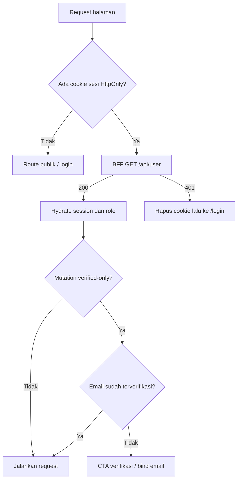

# Information architecture Portal SI Web

## Prinsip navigasi

- URL adalah sumber state navigasi untuk profil, post, clips, story, dan percakapan yang aman di-deep-link.
- Mobile memakai bottom navigation: Beranda, Jelajah, Buat, Store, Profil. Pesan dan Notifikasi tetap hadir di top bar.
- Tablet memakai rail ringkas; desktop memakai sidebar sticky, kolom konten utama, dan right rail kontekstual.
- Route private tidak membocorkan data melalui cache SSR dan memakai `noindex`.
- Tombol Buat membuka menu berbasis role: Postingan, Clips, Cerita, dan Pengumuman hanya untuk `teacher|dev`.

## Sitemap

```text
/
├── (public)
│   ├── /welcome
│   ├── /login
│   ├── /register
│   ├── /forgot-password
│   ├── /reset-password?token=&email=
│   ├── /verify-email
│   ├── /verified-success
│   └── /u/:username                 profil publik sesuai privacy backend
└── (app)                            auth BFF + session bootstrap
    ├── /home                        feed, story rail, pinned announcement
    ├── /explore                     grid, search user, filter tag/sort
    ├── /posts/:postId               detail post + thread komentar
    ├── /stories/:userId             story viewer
    ├── /clips/:postId               vertical clips viewer
    ├── /messages                    inbox direct + group
    │   ├── /new                     cari user
    │   ├── /direct/:userId          direct conversation
    │   └── /groups/:groupId         group conversation
    ├── /groups/new
    ├── /groups/:groupId/info
    ├── /groups/:groupId/members
    ├── /notifications
    ├── /announcements
    ├── /announcements/new           teacher/dev UI guard
    ├── /announcements/:id/edit
    ├── /create/post
    ├── /create/story
    ├── /create/clips
    ├── /drafts                      IndexedDB, local-only
    ├── /profile                     profil sendiri
    ├── /u/:username                 profil pengguna lain
    ├── /profile/edit
    ├── /profile/followers
    ├── /profile/following
    ├── /follow-requests
    ├── /portfolio
    ├── /portfolio/:aspect
    ├── /ranking
    ├── /store
    └── /settings
        ├── /account
        ├── /privacy
        ├── /password
        ├── /sessions
        ├── /saved
        ├── /story-archive
        ├── /preferences              local-only, diberi label
        └── /delete-account
```

## Alur sesi dan guard



Token Sanctum hanya berada di penyimpanan server-side session/cookie terenkripsi atau cookie HttpOnly yang tidak dapat dibaca JavaScript. BFF meneruskan bearer ke Laravel. CSRF diperiksa pada mutation BFF. Tidak ada fallback diam-diam ke localStorage untuk production.

## Layout per breakpoint

| Viewport     | Navigasi                                      | Konten                                               | Pola percakapan                       |
| ------------ | --------------------------------------------- | ---------------------------------------------------- | ------------------------------------- |
| `<768px`     | top bar ringkas + bottom nav fixed, safe-area | satu kolom penuh; modal sekunder menjadi sheet/route | inbox dan conversation route terpisah |
| `768–1199px` | rail ikon/label ringkas                       | kolom utama terpusat, panel sekunder opsional        | split view bila lebar mencukupi       |
| `>=1200px`   | sidebar kiri sticky                           | main maksimal ±680px + right rail                    | split pane inbox/conversation         |

## Domain dan entry point

| Domain        | Entry point               | Secondary actions                           | State wajib                                         |
| ------------- | ------------------------- | ------------------------------------------- | --------------------------------------------------- |
| Auth          | welcome/login/register    | forgot, bind email, resend verify           | bootstrap, cooldown, 401/403/422/429                |
| Home          | `/home`                   | refresh, open story/post/profile            | skeleton, feed empty, partial error, end pagination |
| Explore       | `/explore`                | search, tag, popular/newest                 | debounced search, 404-as-empty, stable grid         |
| Post          | card dan `/posts/:id`     | like, bookmark, comment, share, edit/delete | optimistic rollback, ownership guard                |
| Story         | story rail                | view, reply, viewers, delete                | once-only view, pause/mute/error                    |
| Clips         | explore/profile/deep link | play, mute, like, comment, share            | only active video plays                             |
| Messages      | `/messages`               | new DM, open group, chat info               | unread, online, pending/sent/failed                 |
| Group         | inbox/special groups      | member/admin actions                        | role from API, membership guard                     |
| Profile       | own nav / avatar links    | follow, message, edit, share                | privacy/pending/mutual states                       |
| Notifications | bell                      | mark one/all, entity navigation             | grouped dates, unread state                         |
| Announcement  | home/right rail/list      | detail, create/edit/delete                  | role UI guard + server response                     |
| Portfolio     | profile and portfolio hub | filter aspect/year, CRUD                    | server authorization surfaced honestly              |
| Ranking       | profile/portfolio hub     | search, refresh                             | stale cache + isolated third-party error            |
| Store         | primary nav               | open external store                         | allowlist, external-origin indicator                |
| Settings      | profile menu              | sessions, password, saved, archive          | local/server preference distinction                 |

## Navigasi notifikasi

| Notification type                                              | Target                                                          |
| -------------------------------------------------------------- | --------------------------------------------------------------- |
| `follow`, `follow_accepted`                                    | `/u/:senderUsername`                                            |
| `like`, `comment`, `reply`, `mention` dengan `related_post_id` | `/posts/:postId`                                                |
| entity tidak ada/terhapus                                      | tetap tandai read, tampilkan pesan “Konten tidak lagi tersedia” |

## Model modal, sheet, dan focus

- Desktop memakai dialog untuk konfirmasi/destructive action dan popover untuk create menu.
- Mobile memakai bottom sheet untuk secondary actions; composer utama tetap route agar refresh/deep link aman.
- Semua dialog focus-trap, mengembalikan focus ke trigger, dan dapat ditutup dengan Escape bila tidak destructive-in-progress.
- Menutup media viewer mengembalikan posisi scroll dan focus pada card/grid asal.

## Batas public/private dan SEO

- Public: welcome, auth pages, verified success, serta profil `/u/:username` sejauh backend mengizinkan.
- Private/noindex: home, explore authenticated, post private, stories, clips personalized, messages, notifications, settings, saved, archive.
- Canonical public profile hanya menggunakan username yang dinormalisasi dari response backend.
- Metadata tidak menyertakan caption/chat privat dan SSR response authenticated memakai `Cache-Control: private, no-store`.
